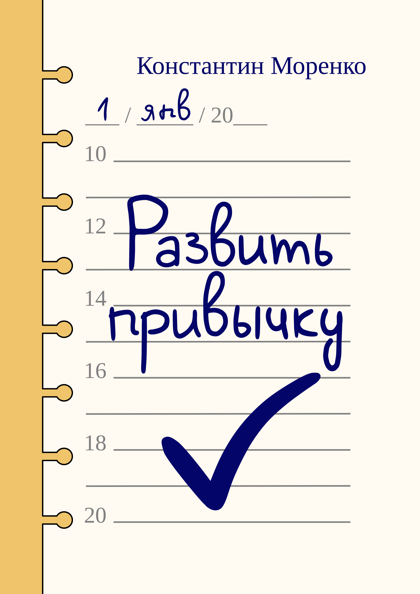

# Коллекци вырезок

В этой коллекции я собираю вырезки из своих книг.  Они могут быть
полезными и в виде отдельных статей.

Чтобы ничего не пропустить, вот [Канал в Яндекс.Дзен](https://dzen.ru/konstantin_morenko).

  

    

	  
    

	

	  <header><a href="howto-write-book/">Как написать книгу</a></header>
	  
Как написать книгу?  Какой маршрут выбрать, что понадобится с
  собой, какие навыки будут полезны в дороге, зачем заручаться
  поддержкой друзей и как рассчитать свои силы, чтобы их хватило до
  конца путешествия, на что нужно обращать внимание в дороге и где
  прекрасные виды — об этом и многом другом я расскажу в книге.

  
<a href="https://www.litres.ru/konstantin-morenko/kak-napisat-knigu/">ЛитРес</a>
     <a href="https://ridero.ru/books/kak_napisat_knigu_2/">Ridero</a>

	

  

  

    

	  
    

	

	  <header><a href="habits/">Развить привычку</a></header>
	  
Сколько раз каждый из нас начинал новую жизнь с понедельника?  И
    сколько раз это удавалось?  Все знают, что привычки — реальный и очень
    мощный инструмент.  Но как же им пользоваться?  Эта книга приоткрывает
    завесу таинственности над процессом развития привычек.  Раскладывает
    по полочкам отдельные шаги, которые ведут к успешному развитию
    привычек.  Книга станет вашим надежным спутником на пути понимания и
    использования этой фантастической силы — привычки.

  
<a href="https://www.litres.ru/konstantin-morenko/razvit-privychku/">ЛитРес</a>
     <a href="https://ridero.ru/books/razvit_privychku/">Ridero</a>

	

  

